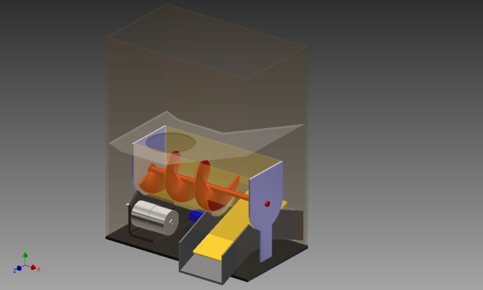
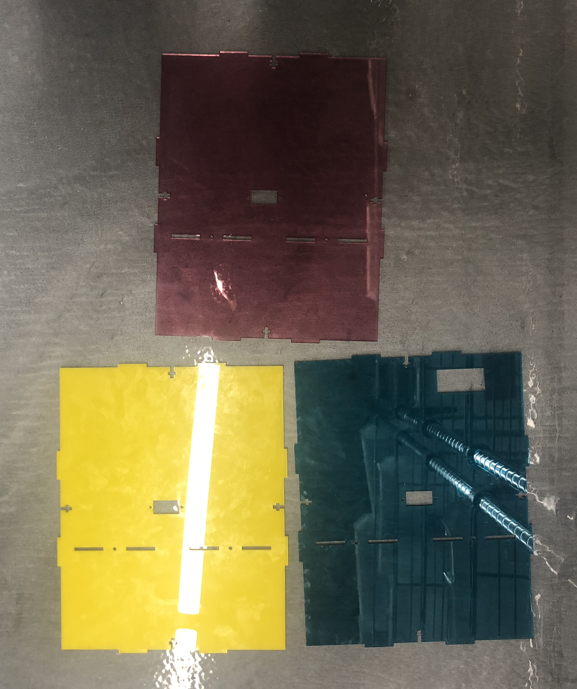
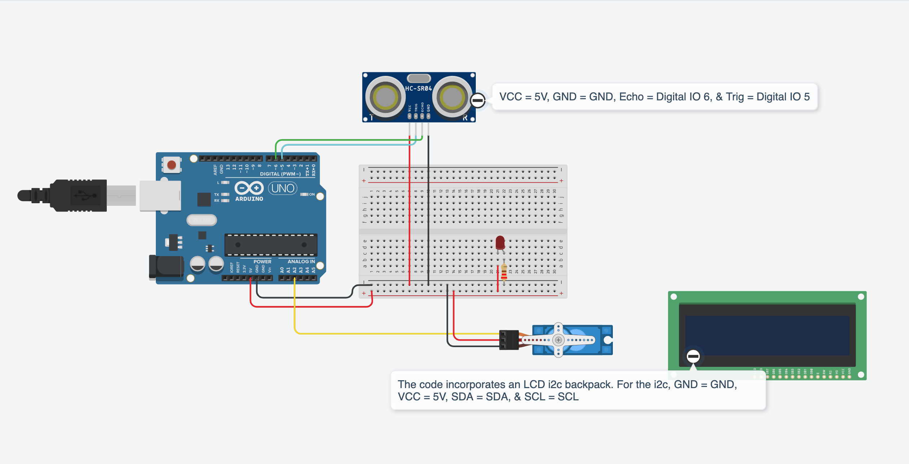
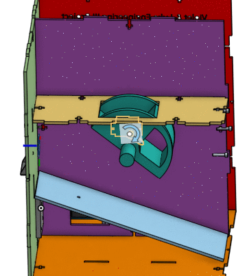
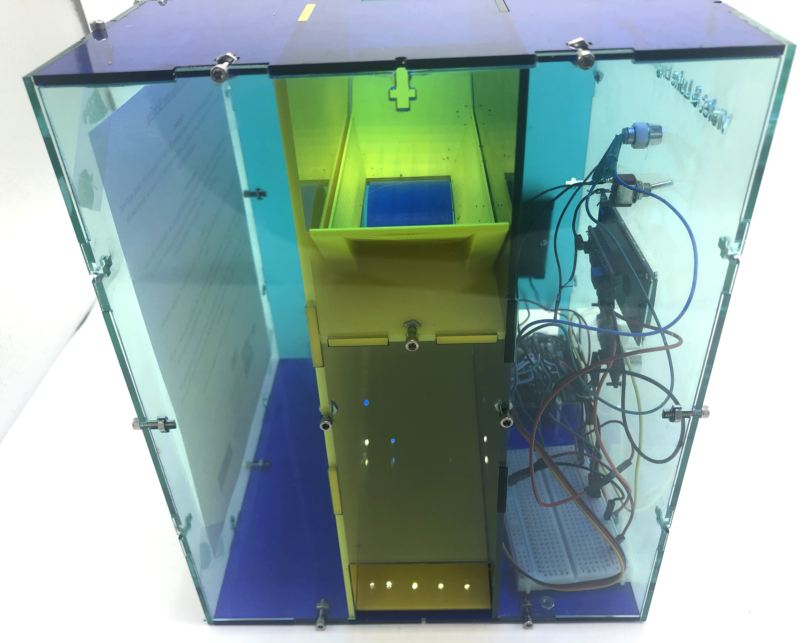
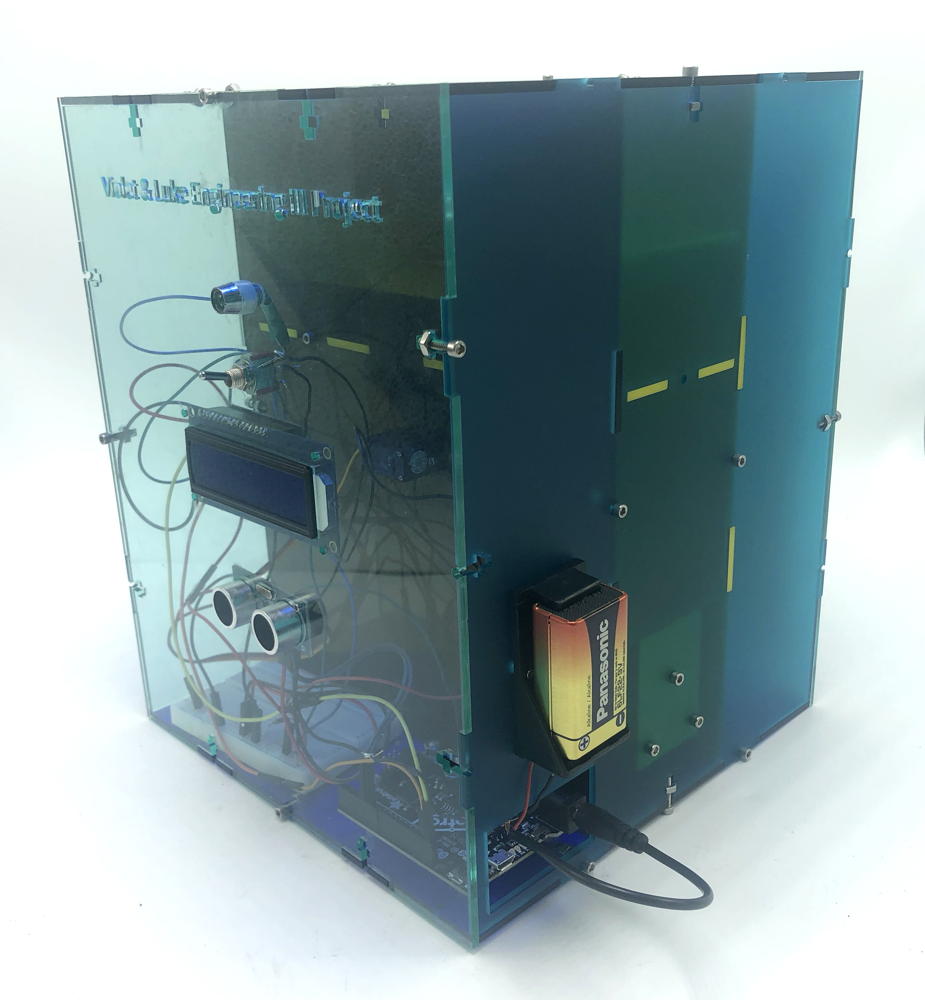
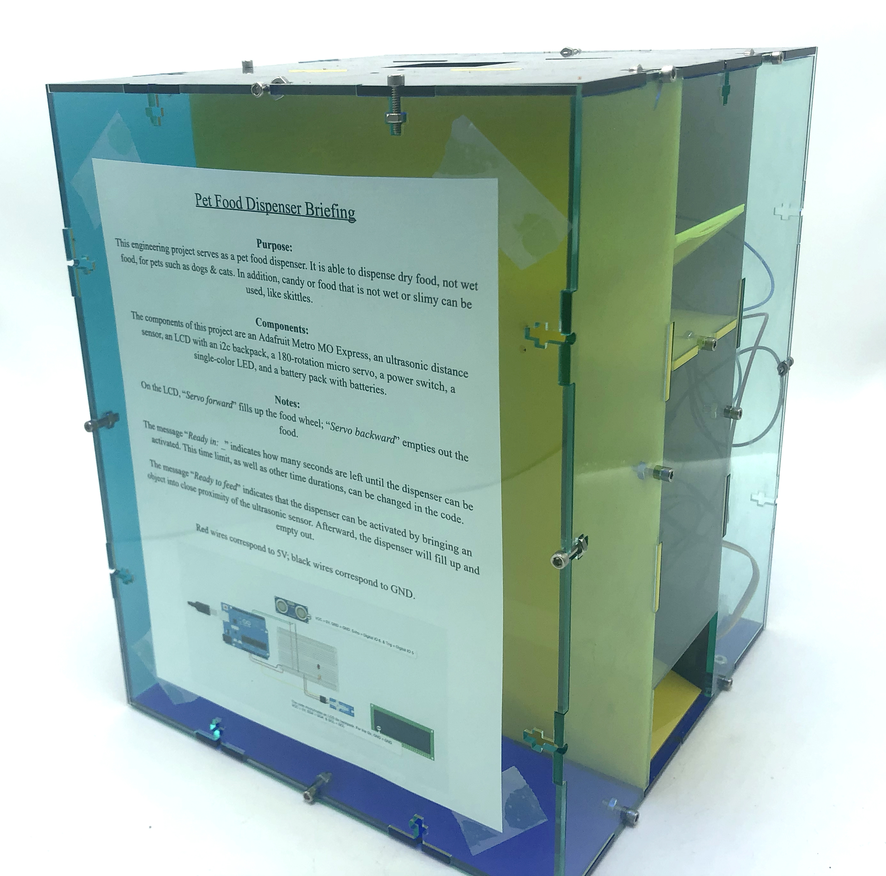
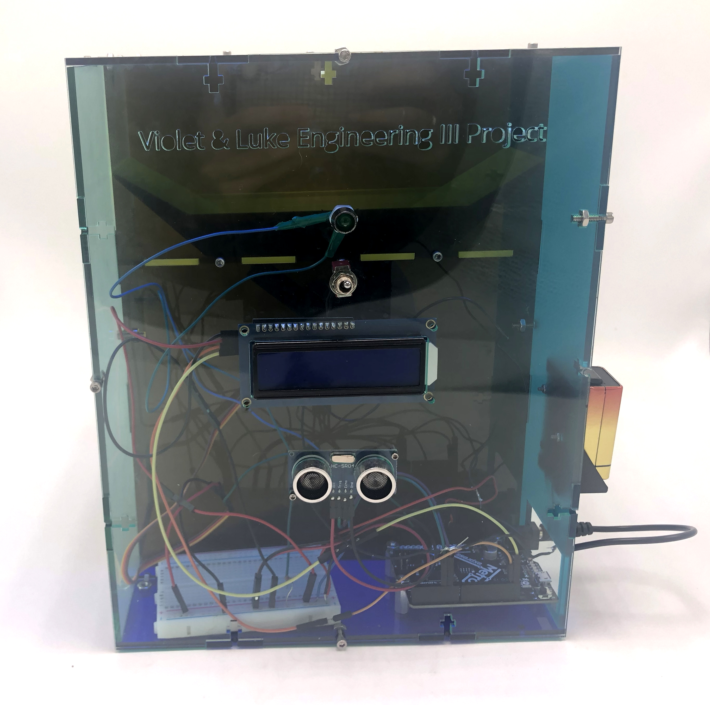

# Pet Food Dispenser

**Note** - For more information about this project, please feel free to visit our [project GoogleDoc](https://docs.google.com/document/d/1ZKXdEp18WFhlqO-TDtYp-zZMlVuGLO5934JrBp6huCs/edit?usp=sharing). The project GoogleDoc contains inventory, idea brainstorms, schedule, cute pet pictures, and initial project ideas.

# Overview
After completing the basic OnShape and CircuitPython assignments, the next assignment was the first Engineering III 
project. The project did not have many constraints. Its main goal was to be a challenging project. No specific task was 
given, but the project had to make use of CircuitPython and CAD (Computer-Aided Design).

For the first Engineering III project, we (Violet Craghead-Way and Luke Frank) decided to create a pet food dispenser. 
Both having pets, a pet food dispenser sounded like an applicable and fun idea. 
The tools that were used for this project are as follows:

* OnShape - OnShape was used for CAD. OnShape was helpful because it is a cloud-based program. 
  It automatically saves work to the cloud. Working on the cloud is a useful measure against data loss. 
  Unlike Solidworks, another CAD program, OnShape allows for collaboration at the same time.

* PyCharm - PyCharm, an Integrated Development Environment (IDE), was used for CircuitPython. PyCharm is useful in that it is compatible with GitHub 
  commits, pushes, and pulls. It creates links between sections of code and checks that functions are correctly called, that syntax is correct, etc. 
  It also has spell checks, a built-in serial monitor, and can suggest code improvements.

* Caret - Similar to PyCharm, Caret was used for CircuitPython. Note that **Caret is for Chromebook.** PyCharm operates 
  only on Macs and PCs. For Chromebooks, Caret is a useful piece of software for programming in CircuitPython. It does 
  not have a built-in serial monitor, so the application **Beagle Term** (serial monitor) goes hand-in-hand with it.

### If it is helpful, here is the link to the T-Slot feature OnShape document: [T-Slot Link](https://cvilleschools.onshape.com/documents/5791a167e4b03c2aa6af3b35/w/8528f1c2d733302d4632f38e/e/7eab6eb8ff7dea85b9cc6a87)

# The Problem And Goal 

Dealing with hungry pets is frustrating. Whether it is the mournful meow of a cat or the piercing puppy eyes of a 
dog, hungry pets can be both distracting and irritating. We each have two pets 
(a dog and cat for Luke and two dogs for Violet), so we understand the struggle.

Luckily, with a pet food dispenser, mealtime for pets can be made into a more entertaining and enjoyable experience. 
Pets would no longer come pleading to humans for their food because their food source would be in one place. 
Additionally, an automated pet food dispenser would give pets a concrete sense of a mealtime schedule 
which would be hard to rival when done by humans. 

# Brainstorm

### Archimedes Screw

The brainstorm began with the idea of an Archimedes screw. The basic components of the design were an Archimedes screw, 
a continuous rotation servo that rotated the Archimedes screw, and a hole-shaped dispensing area for pouring the food into. 
Additionally, the rate by which food was supplied to a pet would be determined by the speed of the continuous-rotation 
servo. Finally, the design included an inclined plane for the food to travel on after being transported by the 
Archimedes screw. The inclined plane would lead to a pet food bowl or to space where the pet could eat the food.

**Note - citation for the website where the image was taken from:** 
Kristina Panos, et al. “Dual Pet Food Dispenser Is Doubly Convenient.” Hackaday, 31 May 2015, http://hackaday.com/2015/05/31/dual-pet-food-dispenser-is-doubly-convenient/. 

**EasyBib was used for generating the MLA citation.**

However, the Archimedes screw design was rejected because of its inconvenience in laser cutting. The screw would have 
required an inefficiently large amount of 3D printing. The alternative to 3D printing was to develop a 2D design that 
could expand, but a 2D expandable design was determined to be unideal and unnecessarily complicated.

### Two Gears 

Our second idea was to have two gears: one with a hole that would create a pathway when aligned with the hole on the 
wall, and another that would be attached to that gear and the 180 servo. The wheel would turn 90 degrees, stay for 
a few seconds to dispense the right amount, and then go back to its original position covering the hole. 

However, this design was flawed in that food pellets could be crushed when the wheel rotated. Additionally, the weight 
put on the servo would have been very heavy, considering the weight of the pet food. Because of these reasons, 
the design seemed flawed, so we brainstormed again.

### Water Wheel

Our second to last brainstorm idea was a water-wheel-like design would dispense pet food pellets 
instead of water. This was slightly modified to make a better version later on (see 180 servo). 
The food would flow into the small containers inside the food wheel and then would move in a circular 
motion. The pull of gravity and the push of a continuous rotation servo would turn the continuous rotation servo, and 
the food pellets would drop when the container faced downward. The food would be contained by rubber hinge flaps 
while it would be filling up to keep the small containers in the food wheel closed. When the wheel would do a complete 
rotation, a certain quantity of food would be dispensed, so it would be easy to measure and provide serving sizes. In 
addition, when the food would drop from the small containers into the box, an inclined plane would bring the food down 
to the bowl. 

### 180 servo- Final approach

The last design that we ended up using for our final project was a 180 servo design! It was similar to the water wheel 
design. It was chosen because 180 servos have more strength and are easier to accurately position. The mechanism works 
by turning the cup to fill it up, dumping it down into the box, and then sliding the food down.

### Project Design and Measurements

These are the measurements for the first water wheel, hinge 
(for opening the battery holder/food container), and funnel walls. The water wheel design worked; however, the 
funnel design was difficult to mate together in OnShape, so it was then decided to create a box with a 3D design insert 
that would act as inclined planes around the hole of the box so that the food moves down to the water wheel. 

# Schedule (all online school)

| Date: | Goal: |
| --- | --- |
| As of 1/13/21: | A design idea for CAD involving a food wheel, funnel, and slide. |
| 1/27/21 | A draft of what the 3D design will be. It does not have to be created in OnShape, but there should be a plan for how the design will be made. |
| 2/10/21: | A rough draft of 3D design on OnShape. The funnel, wheel, and slide are assembled in a way that they would be able to work together. Additionally, a rough draft of the code. |
| 2/17/21: | A revised draft of the 3D design on OnShape, as well as the code. |
| 2/24/21: | Another revised 3D design on OnShape. Ideally, this or the previous design can be tested in the Sigma Lab. If it does not work, then one final 3D design will be created. |
| 3/1/21: | The final 3D prototype design on OnShape. |
|Until in-person time|Print out walls as much as possible, wait to receive materials|

# In-person scheduling (hybrid schedule)
| Week of: | What we did: online, *in person*|
| --- | --- |
|4/12/21|Luke: *Cut holes in walls with an Exacto knife.*, On OnShape, cut holes for LCD, Ultrasonic sensor, LED, and switch into the right wall.|
|4/12/21|Violet: *Laser-cut new walls and extended wires.* Create/Design Bottom and top walls - Metro MO Express cut.|
|4/19/21|Luke: *Laser-cut walls.* Configure PyCharm (not a priority).
|4/19/21|Violet: *Laser-cut walls.* Assemble the design, create hinge for top wall.|
|4/26/21|Luke: *Troubleshoot code.* Figure out the right angle for dispensing.
|4/26/21|Violet: *Planning and designing* Design holes for bottom wall, metro, and battery mounts.

# OnShape Document:

Here is the link to the OnShape document: 
[OnShape Document](https://cvilleschools.onshape.com/documents/015179800deb9471f00f5f8e/w/bea41924170b278a6561fb34/e/8fa549fe2ac3d84aadd2efb3)

This OnShape document will contain the CAD for our project. 

# Lessons Learned

## OnShape Lessons - Violet

* Communicating design ideas over zoom can be difficult, so we found that creating simple cardboard prototypes of our 
  designs helped illustrate our ideas, in addition to using the whiteboard website and sharing our screens. 

* Be sure to assemble the correct version of the part that you will be using in real life. I made the mistake of 
  assembling everything with the standard servo arm and base instead of the micro servo arm and base.

* Naming OnShape parts and sketches help to organize information and is useful when reflecting/modifying a design.

* "Analysis paralysis," when there is a seemingly endless loop of altering and switching designs, can lead to time being 
  unnecessarily used up. We switched our design from a continuous rotation design(water wheel) to a 180 cup-filling 
  design. It requires alterations to the wheel and the position of the funnel wall, but the rest of the design remained 
  the same.

* In Engineering CAD design, it is almost always possible to make one more improvement or adjustment. It can be hard to 
  stick with a design that is not perfect, but it is important to recognize the balance between design and testing.

* Materials can take up to a month to obtain, so be sure to have other things to do while you wait. 
  This is a good time to document on GitHub and work on future design elements. I worked on the outer walls, metro 
  express and battery holder holes, and the hinge design. 

* Be sure to update your drawing on OnShape before laser cutting - it's the orange circle button at the top left. 
  We didn't update the sketch for one of the servo walls and the back wall, so it didn't fit into the new version of the 
  box. There were several laser-cut parts that did not work because of design errors. Here are some of them: 

* Friction fit for servos is very difficult, so be sure to make a hole with at least 5 mm of wiggle room, and have holes 
  for the servo screws to secure it in place. This is an image of all the servo walls we had to print out before finding 
  the right fit. 

## Coding/CircuitPython Lessons - Luke

* For versioning code - documenting the stages of a code's development - it is unnecessary to create separate code files. 
  What had originally been done was creating a code file such as `core_code.py`, then saving a new file as 
  `continuous_lcd_addition.py`. Instead, using Git Commits is much easier and better. 
  
* Using Git Commits instead of separate saved files makes the project files seem more organized, allows for a history to 
  be created for one single file that can then be looked at and reverted to, and is relatively straightforward. 
  
* A general rule of thumb: commit and push whenever leaving the computer or at a milestone. Then, adding a message 
  such as "created function for servo turning mechanism" serves to document the changes made - it will be useful when looking back.

* The code comments explain most of how the code works. Here is the code: [main.py](./main.py)

* This coding assignment was unique in that functions were established inside the `main.py` to organize separate tasks
  that the code performed. For further information, please look at the code comments. Basically, the code used the 
  functions/classes that a library uses.
  
* When thinking of a function, it is helpful to compare it to an algebraic equation with an input (x) and output (y).

* By convention, constant variables, meaning variables that are set to numbers that do not change, are usually UPPER CASE.
  Using constant variables helps to assign meaning to different values, making the code easier to understand. For example,
  setting the constant variable `CLOSED POSITION` equal to `my_servo.angle`.

# Circuit Diagram

* Here is the wiring diagram, though the LCD is in need of an i2c backpack, which does not appear to be on TinkerCad:

#### Note - The circuit diagram was made on Tinkercad, which does not have an Adafruit Metro MO Express import option. The circuit diagram might be changed another time if a better circuit diagram creator is found.

# Pet Food Dispenser Briefing/Instructions

* Here is a .PDF of the instructions and background of the pet food dispenser. The .PDF was printed out and taped onto the final product to provide information for possible viewers and users: 
[Pet Food Dispenser Briefing](./Engineering_III-Pet_Food_Dispenser-Instructions.pdf)

# Final Product

Here are some images and a GIF of the final product. The GIF was taken from the project [OnShape Assembly.](https://cvilleschools.onshape.com/documents/015179800deb9471f00f5f8e/w/bea41924170b278a6561fb34/e/8fa549fe2ac3d84aadd2efb3)

### GIF

### Final Pictures

### Final Note 
Quite interestingly, it seems that dogs and cats are able to hear the frequencies emitted from the ultrasonic distance 
sensor. This is something that had not been considered at the beginning of the project and is a good example of how 
unforeseen variables can sometimes appear as a project progresses. The project should be tested with each pet 
individually as responses to the ultrasonic distance sensor might vary, but, if pets are spooked by the frequencies, 
this project can double-up as a candy dispenser :) 
